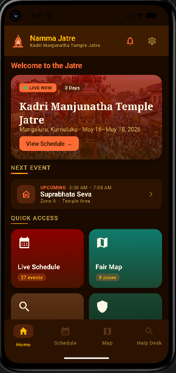
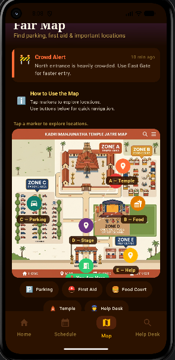
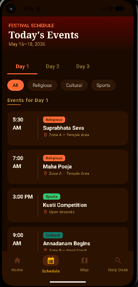
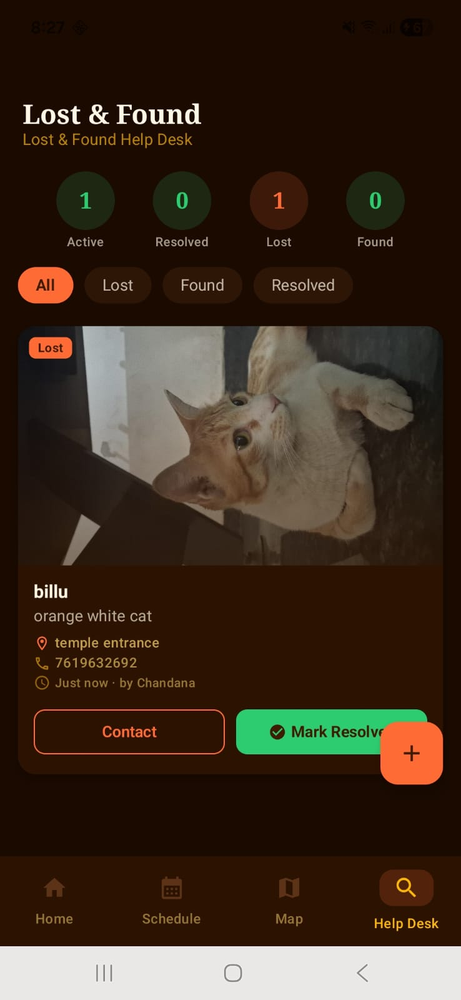
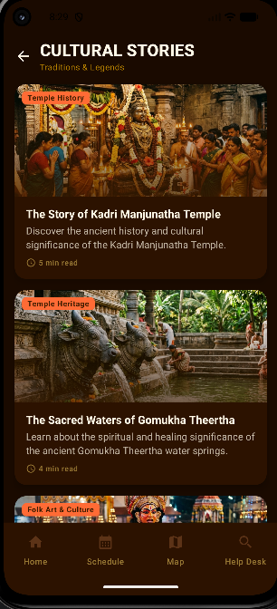

# Jatre-Namma Pride

## Problem Statement
Jatre-Namma Pride is a digital guide application designed for village temple fairs and Jatres in Karnataka. The app helps visitors understand event schedules, safety locations, cultural stories, parking areas, and Lost & Found services during large festival gatherings.

---

## Features

- Live Event Schedule
- Fair Map with Zones
- Lost & Found System
- Safety Alerts
- Event Notifications
- Cultural Stories
- English & Kannada Localization
- Firebase Real-Time Integration

---

## Festival Theme

Kadri Manjunatha Temple Jatre  
Mangaluru, Karnataka

---

## Tech Stack

- Kotlin
- Jetpack Compose
- Firebase Firestore
- Room Database
- MVVM Architecture
- Android Studio

---

## Fair Map Zones

- Zone A — Temple Area
- Zone B — Food Court
- Zone C — Parking Area
- Zone D — Main Stage
- Zone E — Help Center

---

## Installation Steps

1. Clone the repository
2. Open project in Android Studio
3. Sync Gradle
4. Connect Firebase
5. Run the app on emulator or physical device

---

## Screenshots

---

## Future Improvements

- Live crowd tracking
- Admin event management
- GPS-based navigation
- Emergency SOS support
- Multi-festival support